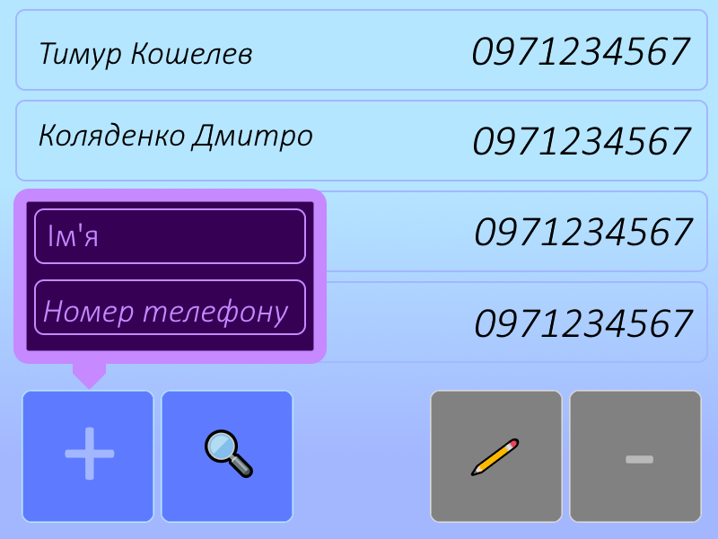

# 1. Планування

Мета: створити простий додаток "Менеджер контактів", який дозволяє користувачам зберігати імена та номери телефонів для швидкого доступу до них.

# 2. Аналіз вимог (User stories)

1. Як користувач, я хочу додавати новий контакт (ім'я, телефон), щоб зберігати дані нових знайомих. ✅ (Must have)
2. Як користувач, я хочу переглядати список усіх контактів, щоб швидко знаходити потрібну людину. ✅ (Must have)
3. Як користувач, я хочу видаляти неактуальні контакти, щоб підтримувати список у порядку.
4. Як користувач, я хочу редагувати існуючий контакт, щоб оновлювати номер телефону.
5. Як користувач, я хочу шукати контакт за ім'ям, щоб не гортати весь список вручну.

# 3. Дизайн (Прототип)

*(На прототипі представлено єдиний головний екран, що поєднує всі функції. Зверху розташований список збережених контактів. Знизу — функціональна панель із кнопками: синій "+" для додавання (що відкриває спливаюче вікно форми, як показано), лупа для пошуку, сірий олівець для редагування та сірий мінус для видалення).*

# 4. Реалізація (Псевдокод)

    function addContact(name, phone):
        if name is empty or phone is empty:
            return "Error: Name and phone are required"
        else:
            contact = createContact(name, phone)
            contactList.add(contact)
            return "Contact successfully added"

# 5. Тестування

1. Додати контакт "Тимур Кошелев", телефон "0971234567" → контакт успішно додається і з'являється у списку.
2. Спроба додати контакт із порожнім полем імені → система видає помилку "Error: Name and phone are required".
3. Спроба додати контакт із порожнім полем телефону → система видає помилку.

# 6. Висновки

Для розробки такого простого додатку найкраще підходить Agile-підхід із короткими ітераціями. Він дозволить швидко реалізувати базовий функціонал (додавання і перегляд контактів) та поступово додавати нові функції, наприклад, пошук або редагування. Waterfall був би занадто жорстким, а Spiral — невиправдано складним для такого маленького проєкту.